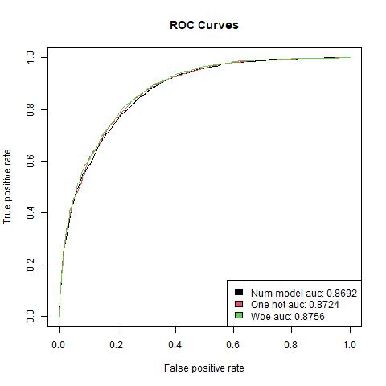
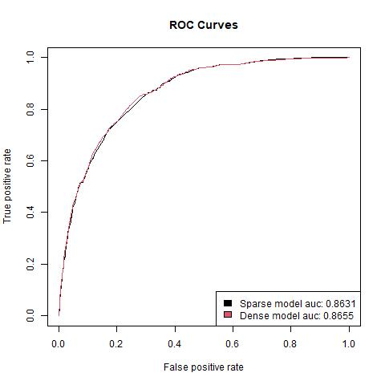

```{r setup, include=FALSE}
knitr::opts_chunk$set(echo = FALSE)
```

### Formål
Formålet med dette projekter er empirisk at undersøge og forstå XGBoost algoritmen. 

#### Data
Til at undersøge XGBoost bruges følgende datasæt:   
  - [Adult](https://rpubs.com/H_Zhu/235617)

#### XGBoost og kategorisk data
```{r results_cat_features}
load("./results/cat_features_result.rda")
```

Her er blevet trænet 3 xgboost modeller med binær target på features der alle er kategoriske på adult-datasættet. Forskellen på modellerne er hvordan de kategoriske features er håndteret. Der er gjort på følgende måde:  
  1. De er blot taget med som numeriske features  
  2. De er one-hot encoded  
  3. Weight of evidens er benyttet  

Modellerne er blevet tunet med random search metoden, med en tune length på `r cat_features_result$tune_lenght`, på følgende parametre; `r cat_features_result$tune_params`.

Træningstiderne for de 3 modeller kan ses her:  
  1. Model med numeriske features: `r cat_features_result$time_num_model[[1]]` sekunder  
  2. Model med one hot encoded features: `r cat_features_result$time_one_hot_model[[1]]` sekunder  
  3. Model med weight of evidence encoded features: `r cat_features_result$time_woe_model[[1]]` sekunder  

En roc kurve med tilhørende auc værdier for hver af de 3 modeller ses i plottet.  


Til sidst er accuracy udregnet med et cutoff på 0.5 for hver model.   
  1. Model med numeriske features: `r round(cat_features_result$acc_num_model, 4)`   
  2. Model med one-hot encoded features: `r round(cat_features_result$acc_one_hot_model, 4)`  
  3. Model med weight of evidens encoded features: `r round(cat_features_result$acc_woe_model, 4)`  


#### Sparse vs dense træningsdata
```{r results_sparse_dense}
load("./results/sparse_vs_dense_result.rda")
```

Her er blevet trænet 2 modeller på identisk datagrundlag. Forskellen ligger i dataformatet til XGB-modellen. I det ene tilfælde er input til modellen en sparse matrix (dgCMatrix) og i det andet tilfælde er input en dense matrix (matrix). Den primære interesse er at finde ud af, hvor stor tidsforskellen er på at træne en XGB-model på henholdsvis sparse og dense data. Modellerne tunes med `r sparse_vs_dense_result$cv` fold crossvalidation over det samme random search grid med længden `r sparse_vs_dense_result$tune_lenght` på parametrene; `r sparse_vs_dense_result$tune_params`. Træningstiden kan ses her:  
  - Model på sparse data: `r sparse_vs_dense_result$time_sparse_model[[1]]` sekunder  
  - Model på dense data: `r sparse_vs_dense_result$time_dense_model[[1]]` sekunder  
Som der kan ses er modellen tunet på sparse data omtrent `r round(sparse_vs_dense_result$time_dense_model[[1]] / sparse_vs_dense_result$time_sparse_model[[1]], 1)` gange hurtigere end modellen tunet på dense data. 

En roc kurve med tilhørende auc værdier for de 2 modeller ses i plottet.  


Til sidst er accuracy udregnet med et cutoff på 0.5 for hver model.   
  - Model på sparse data: `r round(sparse_vs_dense_result$acc_sparse_model, 4)`   
  - Model på dense data: `r round(sparse_vs_dense_result$acc_dense_model, 4)`  
  
<!-- skyldes forskellen i resultaterne random subsampling i modellerne fx i subsample_bytree, eller er det pga. input dataformatet? -->


  
