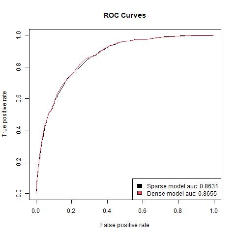

Readme
================

### Formål

Formålet med dette projekter er empirisk at undersøge og forstå XGBoost
algoritmen.

#### Data

Til at undersøge XGBoost bruges følgende datasæt:  
\- [Adult](https://rpubs.com/H_Zhu/235617)

#### XGBoost og kategorisk data

Her er blevet trænet 3 xgboost modeller med binær target på features der
alle er kategoriske på adult-datasættet. Forskellen på modellerne er
hvordan de kategoriske features er håndteret. Der er gjort på følgende
måde:  
1\. De er blot taget med som numeriske features  
2\. De er one-hot encoded  
3\. Weight of evidens er benyttet

Modellerne er blevet tunet med random search metoden, med en tune length
på 100, på følgende parametre; eta, max\_depth, gamma,
min\_child\_weight, subsample, colsample\_bytree, lambda.

Træningstiderne for de 3 modeller kan ses her:  
1\. Model med numeriske features: 302.08 sekunder  
2\. Model med one hot encoded features: 345.94 sekunder  
3\. Model med weight of evidence encoded features: 271 sekunder

En roc kurve med tilhørende auc værdier for hver af de 3 modeller ses i
plottet.  

Til sidst er accuracy udregnet med et cutoff på 0.5 for hver model.  
1\. Model med numeriske features: 0.8277  
2\. Model med one-hot encoded features: 0.8236  
3\. Model med weight of evidens encoded features: 0.8312

#### Sparse vs dense træningsdata

Her er blevet trænet 2 modeller på identisk datagrundlag. Forskellen
ligger i dataformatet til XGB-modellen. I det ene tilfælde er input til
modellen en sparse matrix (dgCMatrix) og i det andet tilfælde er input
en dense matrix (matrix). Den primære interesse er at finde ud af, hvor
stor tidsforskellen er på at træne en XGB-model på henholdsvis sparse og
dense data. Modellerne tunes med 5 fold crossvalidation over det samme
random search grid med længden 50 på parametrene; eta, max\_depth,
gamma, min\_child\_weight, subsample, colsample\_bytree, lambda.
Træningstiden kan ses her:  
\- Model på sparse data: 180.14 sekunder  
\- Model på dense data: 540.07 sekunder  
Som der kan ses er modellen tunet på sparse data omtrent 3 gange
hurtigere end modellen tunet på dense data.

En roc kurve med tilhørende auc værdier for de 2 modeller ses i
plottet.  

Til sidst er accuracy udregnet med et cutoff på 0.5 for hver model.  
\- Model på sparse data: 0.8286  
\- Model på dense data: 0.8275

<!-- skyldes forskellen i resultaterne random subsampling i modellerne fx i subsample_bytree, eller er det pga. input dataformatet? -->
